# InfoSSLRec: Contrastive Self-Supervised Sequential Recommendation with Informative Augmentation
InfoSSLRec is a contrastive self-supervised **sequential recommendation** model for dynamic user behavior sequences. The repository also ships a lightweight web system for browsing its recommendations. The model targets three problems that hurt parameter-heavy sequential recommenders:

- **Data sparsity.** Users have few interactions, so the encoder sees too few item-transition patterns.
- **Noisy interactions.** Accidental or misleading transitions blur the real item correlations.
- **Short-sequence cold start.** Interaction data is long-tailed, and most users have very short sequences. Random crop or mask operations can wipe out most of the little information these sequences carry.

InfoSSLRec builds two augmented views of every user sequence and trains a shared Transformer encoder to pull the two views together with an NT-Xent contrastive loss. It optimizes this jointly with next-item prediction. The views come from **informative augmentations** (*Substitute* and *Insert*), which use item correlation from collaborative filtering and from the model's own embeddings. Unlike random crop, mask, or reorder, these operators keep real item-to-item transitions intact.

> The code is built on the [CoSeRec](https://github.com/salesforce/CoSeRec) / [S3-Rec](https://github.com/RUCAIBox/CIKM2020-S3Rec) codebase, so many scripts, checkpoints, and log files still carry the `CoSeRec` prefix.

---

## Table of Contents

- [Highlights](#highlights)
- [Quick Start](#quick-start)
- [Model Architecture](#model-architecture)
- [Repository Structure](#repository-structure)
- [Environment Setup](#environment-setup)
- [Datasets](#datasets)
  - [Download links](#download-links)
- [Training and Evaluation](#training-and-evaluation)
- [Reproducing the Experiments](#reproducing-the-experiments)
- [Web Demo System](#web-demo-system)
  - [Screenshot walkthrough](#screenshot-walkthrough)
  - [How to use it](#how-to-use-it)
- [Results](#results)
- [Acknowledgement](#acknowledgement)

---

## Highlights

- **Correlation-based informative augmentation.** Two operators, *Substitute (S)* and *Insert (I)*, choose items with a hybrid correlation: offline ItemCF-IUF combined with the online similarity of the learned item embeddings. They keep real item transitions, add to sparse interaction records, and ease cold start.
- **Length-adaptive augmentation.** Short and long sequences draw from different operator sets, so augmentation quality doesn't depend on how long a sequence is.
- **Joint multi-task training.** The next-item prediction loss and the NT-Xent contrastive loss are optimized together, end to end. This avoids losing self-supervised signal in a two-stage pre-train/fine-tune pipeline.
- **Interactive demo.** A zero-dependency Python HTTP backend and a single-page HTML/JS frontend show each user's history and the model's Top-20 recommendations in real time.

---

## Quick Start

```bash
# 1. Create the environment (see "Environment Setup" for details)
conda create -n coserec_env python=3.7 -y
conda activate coserec_env
pip install torch==1.7.1+cu101 -f https://download.pytorch.org/whl/torch_stable.html
pip install numpy==1.21.6 scipy==1.7.3 tqdm==4.26.0 gensim==4.2.0 scikit-learn==1.0.2 matplotlib

# 2. Launch the web demo with the bundled checkpoints
python app.py                      # then open http://localhost:8000

# 3. (Optional) Train / evaluate a model
cd src
python main.py --data_name Beauty --model_idx 1 --gpu_id 0     # train
python main.py --data_name Beauty --model_idx 0 --do_eval      # evaluate the bundled checkpoint
```

---

## Model Architecture

<p align="center">
  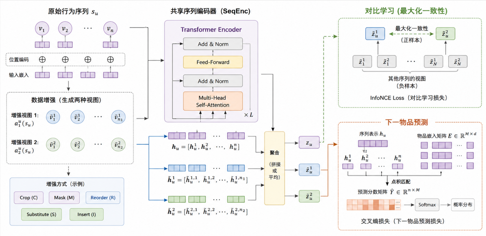
</p>
<p align="center"><em>Overall architecture of InfoSSLRec</em></p>

InfoSSLRec has three core components:

1. **Transformer sequence encoder (SeqEnc).** Item embeddings plus learnable positional embeddings go through `L = 2` stacked self-attention blocks with 2 heads each (multi-head self-attention → Add & Norm → feed-forward → Add & Norm). A causal mask stops each position from attending to future items. The hidden size is `d = 64`. Sequences are truncated to the latest `50` items, or zero-padded at the front if shorter.
2. **Data augmentation module.** It picks two operators `a₁ᵘ` and `a₂ᵘ` according to the sequence length and applies them to the user sequence `sᵤ`, which gives two augmented views.
3. **Contrastive self-supervised module.** The encoder's position-wise outputs for each view are concatenated into one sequence-level vector. The module maximizes agreement between the two views of the same sequence and treats the other `2(N−1)` views in the mini-batch as negatives.

The data flow:

1. **Input & embedding.** The raw sequence `sᵤ = [v₁, …, vₙ]` is mapped to item embeddings plus positional embeddings.
2. **Dual-branch processing.** The original sequence feeds next-item prediction. The augmentation module produces two views for contrastive learning.
3. **Shared encoding.** The original sequence and both views go through the same SeqEnc.
4. **Multi-task optimization.** `L_rec` is computed on the original sequence and `L_ssl` on the two views. Both losses update the shared encoder.

### Next-item prediction

<p align="center">
  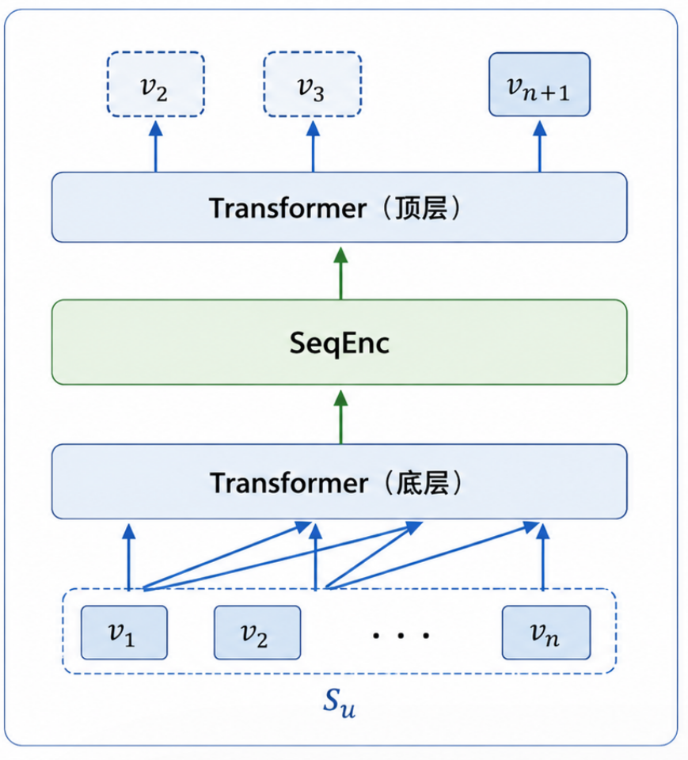
</p>

The encoder output $h_u^t$ at step $t$ is matched against the embedding of the next item $v_{t+1}$ by dot product. It is trained with a binary cross-entropy (log-likelihood) loss using one sampled negative item $v_j$ per step:

```math
\mathcal{L}_{rec} = -\sum_{t}\Big[\log\sigma\big(h_u^{t}\cdot e_{v_{t+1}}\big) + \log\big(1-\sigma(h_u^{t}\cdot e_{v_j})\big)\Big]
```

### Augmentation operators

| Random augmentation (from CL4SRec) | Informative augmentation (proposed) |
| :---: | :---: |
| 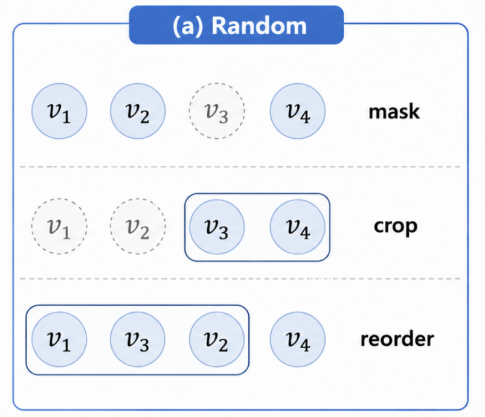 | 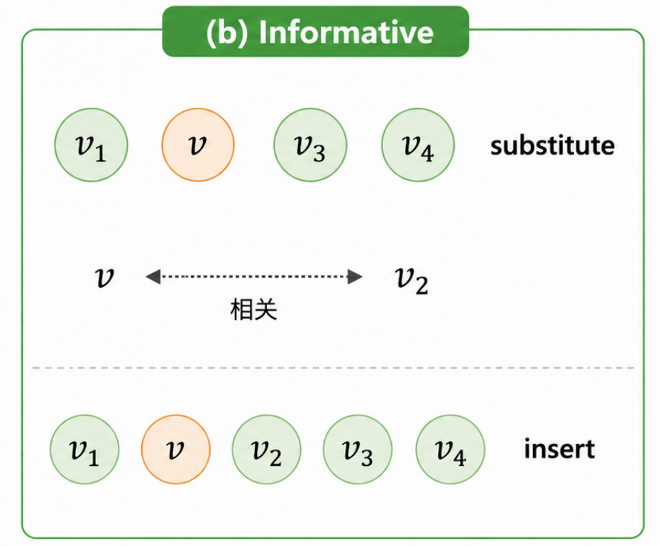 |

| Operator | Type | What it does | Paper symbol | Code argument |
|---|---|---|:---:|---|
| **Crop (C)** | random | keeps a random contiguous sub-sequence of length `⌊η·n⌋` | η | `--tao` |
| **Mask (M)** | random | replaces a `μ` ratio of items with a `[mask]` token | μ | `--gamma` |
| **Reorder (R)** | random | shuffles a random sub-sequence of length `⌊ω·n⌋` | ω | `--beta` |
| **Substitute (S)** | informative | replaces an `α` ratio of items with their most correlated item | α | `--substitute_rate` |
| **Insert (I)** | informative | inserts the most correlated item before a `β` ratio of positions | β | `--insert_rate` |

> ⚠️ Note the naming clash: in the code, `--beta` is the **reorder** ratio ω. The paper's insert ratio β is `--insert_rate`.

*Substitute* reflects the "substitutable item" idea. For example, replacing *iPhone 14* with *iPhone 14 Pro* in `[iPhone 14 → case → 20W charger]` changes the surface item but keeps the purchase intent. *Insert* recovers interactions that were never recorded. For example, `[iPad Pro → Magic Keyboard]` becomes `[iPad Pro → Apple Pencil → Magic Keyboard]`, which also makes short sequences longer.

### Hybrid item correlation

Substitute and Insert choose items with three correlation scores:

**Offline (memory-based) correlation:** ItemCF-IUF, precomputed from co-occurrence. It down-weights very active users and is stored in `data/<dataset>_ItemCF_IUF_similarity.pkl`.

```math
\mathrm{Cor}_o(i,j)=\frac{1}{\sqrt{|\mathcal{N}(i)||\mathcal{N}(j)|}}\sum_{u\in\mathcal{N}(i)\cap\mathcal{N}(j)}\frac{1}{\log\big(1+|\mathcal{N}(u)|\big)}
```

**Online (model-based) correlation:** the dot product of the item embeddings being learned.

```math
\mathrm{Cor}_e(i,j)=\mathbf{e}_i\cdot\mathbf{e}_j
```

**Hybrid correlation:** the maximum of the two scores after Min-Max normalization.

```math
\mathrm{Cor}_h(i,j)=\max\big(\overline{\mathrm{Cor}_o}(i,j),\ \overline{\mathrm{Cor}_e}(i,j)\big)
```

The embeddings carry little information early in training. For the first `E` epochs (`--augmentation_warm_up_epoches`), the model uses only `Cor_o`. After that it switches to `Cor_h`.

### Length-adaptive augmentation

With a length threshold `K` (`--augment_threshold`):

```math
a \sim \begin{cases}\{S,\ I,\ M\} & |s_u| \le K \quad \text{(short: avoid destructive Crop / Reorder)}\\ \{S,\ I,\ M,\ C,\ R\} & |s_u| > K \quad \text{(long: all operators)}\end{cases}
```

Short sequences get lighter operators that add information. Long sequences carry enough items to tolerate random perturbations. The short-sequence operator set is set by `--augment_type_for_short` (default `SIM`).

### Contrastive learning

<p align="center">
  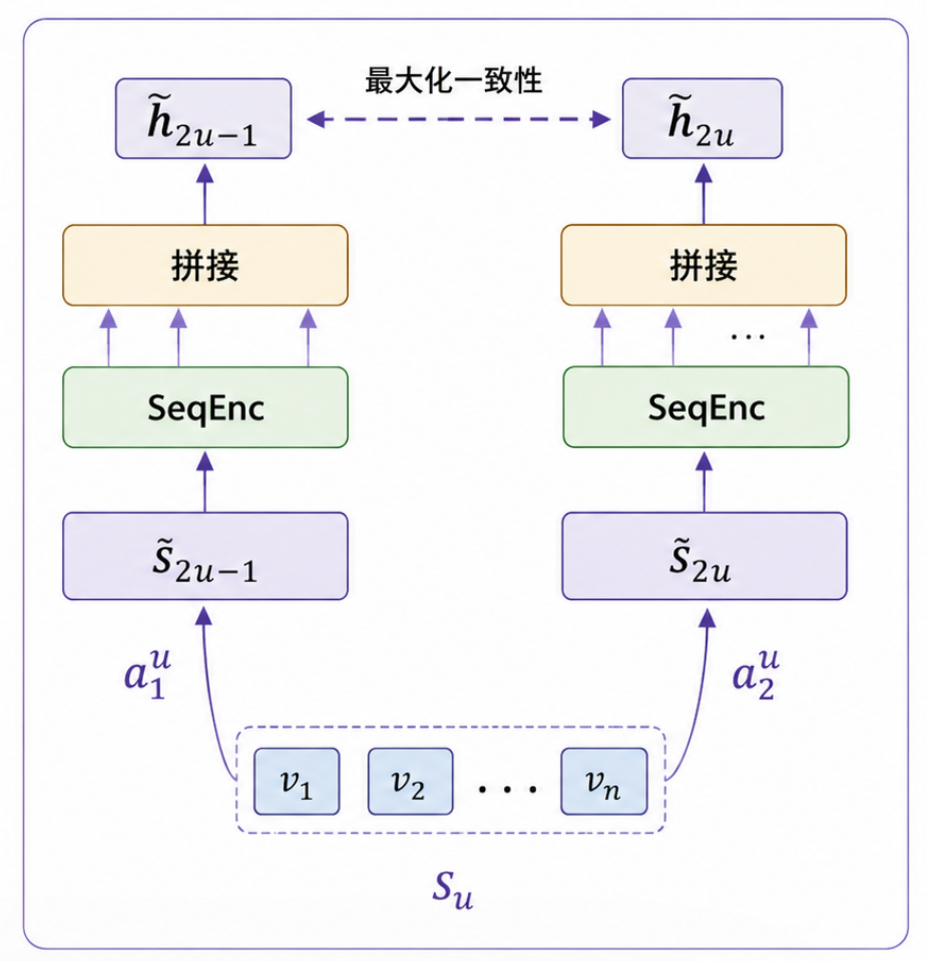
</p>

For a mini-batch of `N` sequences, the augmentation module produces `2N` views. The two views from the same sequence form a positive pair, and the other `2(N−1)` views are negatives. Each view is encoded by the shared SeqEnc and the position-wise outputs are concatenated. The model is trained with NT-Xent, where $\mathrm{sim}(\cdot)$ is the dot product:

```math
\mathcal{L}_{ssl}(\tilde{h}_{2u-1},\tilde{h}_{2u}) = -\log\frac{\exp\big(\mathrm{sim}(\tilde{h}_{2u-1},\tilde{h}_{2u})\big)}{\sum_{m=1}^{2N}\mathbb{1}_{m\neq 2u-1}\exp\big(\mathrm{sim}(\tilde{h}_{2u-1},\tilde{h}_{m})\big)}
```

### Joint objective

```math
\mathcal{L} = \mathcal{L}_{rec} + \lambda\,\mathcal{L}_{ssl} \qquad (\lambda = \texttt{--cf\_weight},\ \text{default } 0.1)
```

The contrastive loss acts as a regularizer, so λ should stay small. A large λ makes the encoder chase view agreement at the cost of next-item accuracy.

---

## Repository Structure

```
.
├── app.py                         # Web demo backend (Python http.server + REST API)
├── frontend/
│   └── index.html                 # Single-page web UI (HTML/CSS/vanilla JS, no build step)
├── src/
│   ├── main.py                    # Entry point: training / evaluation
│   ├── models.py                  # SASRec-style Transformer encoder + offline/online item similarity
│   ├── modules.py                 # Transformer layers, attention, NT-Xent loss
│   ├── data_augmentation.py       # Crop / Mask / Reorder / Substitute / Insert operators
│   ├── datasets.py                # Dataset that builds augmented views for contrastive learning
│   ├── trainers.py                # Training loop, multi-task loss, HR/NDCG evaluation
│   ├── generate_similarity.py     # ItemCF / ItemCF-IUF similarity generation
│   ├── utils.py
│   ├── beauty.sh / sports.sh / yelp.sh   # Example training scripts
│   └── output/                    # Trained checkpoints (*.pt) and training logs (*.txt)
├── data/
│   ├── Beauty.txt / Sports_and_Outdoors.txt / Yelp.txt / Toys_and_Games.txt
│   ├── *_ItemCF_IUF_similarity.pkl    # Precomputed offline item similarity
│   ├── *_item_id_to_meta.json         # Item ID → title/brand/category (for the web demo)
│   ├── *_hit_users.json               # Cached "hit" users for the web demo
│   └── build_amazon_mapping.py        # Builds item metadata mappings from raw Amazon data
├── run_hyperparameter_study.py    # Batch runner for the α / β / K / λ sensitivity study
├── plot_hyperparameter_study.py   # Plots the hyperparameter study results
├── 留一法/                         # Raw logs: leave-one-operator-out ablation
├── 超参数实验/                      # Raw logs: hyperparameter study
├── 鲁棒性实验/                      # Raw logs: data-sparsity robustness study
└── assets/                        # Figures used in this README
```

---

## Environment Setup

Environment used to develop and test the project:

| Package | Version |
|---|---|
| Python | 3.7 |
| PyTorch | 1.7.1 (+cu101, CUDA 10.1) |
| NumPy | 1.21.6 |
| SciPy | 1.7.3 |
| tqdm | 4.26.0 |
| gensim | 4.2.0 (imported by `models.py`; used for Item2Vec similarity) |
| scikit-learn | 1.0.2 |
| matplotlib | only needed for `plot_hyperparameter_study.py` |

```bash
conda create -n coserec_env python=3.7 -y
conda activate coserec_env

# GPU (CUDA 10.1)
pip install torch==1.7.1+cu101 -f https://download.pytorch.org/whl/torch_stable.html
# ...or CPU only
# pip install torch==1.7.1+cpu -f https://download.pytorch.org/whl/torch_stable.html

pip install numpy==1.21.6 scipy==1.7.3 tqdm==4.26.0 gensim==4.2.0 scikit-learn==1.0.2 matplotlib
```

> A CPU-only PyTorch build is enough to run the web demo, since the backend always runs inference on CPU. A GPU is recommended for training. `src/requirements.txt` is inherited from the original CoSeRec repository and lists older versions. Use the versions above instead.

---

## Datasets

The experiments use three public datasets. Each was preprocessed with 5-core filtering (every user and item has at least 5 interactions), and each user's interactions are sorted by timestamp.

| Dataset | #Users | #Items | #Interactions | Avg. length | Sparsity |
|---|---:|---:|---:|---:|---:|
| Amazon Beauty | 22,363 | 12,101 | 198,502 | 8.9 | 99.73% |
| Amazon Sports & Outdoors | 35,598 | 18,357 | 296,337 | 8.3 | 99.95% |
| Yelp | 30,431 | 20,033 | 316,354 | 10.3 | 99.95% |

**Format.** In `data/<name>.txt`, each line holds one user: the user ID followed by that user's item IDs in chronological order.

```
user_id item_1 item_2 ... item_n
```

**Data split (leave-one-out).** For each user, the last item is the test target and the second-to-last is the validation target. Everything before it is used for training.

**Offline similarity.** If `data/<name>_<similarity_model_name>_similarity.pkl` is missing, `main.py` generates it automatically from the training sequences on the first run.

### What is (and isn't) in this repository

| Files | Size | In repo? | Needed for |
|---|---|:---:|---|
| `data/Beauty.txt`, `Sports_and_Outdoors.txt`, `Yelp.txt` (preprocessed sequences) | 1–2 MB each | ✅ | training, evaluation, **web demo** |
| `src/output/CoSeRec-*-0.pt` (trained checkpoints) | ~5 MB each | ✅ | evaluation, **web demo** |
| `data/*_item_id_to_meta.json` (item titles) | 3–6 MB each | ✅ | web demo (item names) |
| `data/*_ItemCF_IUF_similarity.pkl` (offline correlation) | 20–56 MB each | ✅ | training (auto-regenerated if missing) |
| Raw Amazon / Yelp JSON dumps (`amazon_data/`, `data/Yelp JSON/`) | **~20 GB** | ❌ | rebuilding the item-name mappings only |

Everything needed to **train, evaluate, and run the web demo is included**. You only have to download the raw dumps below if you want to rebuild the preprocessed files or the item-name mappings.

### Download links

**Preprocessed sequences.** These are the same `.txt` files as in `data/`, also published by the upstream projects:

- S3-Rec: <https://github.com/RUCAIBox/CIKM2020-S3Rec/tree/master/data>
- CoSeRec: <https://github.com/salesforce/CoSeRec/tree/main/data>

**Amazon Beauty** (Amazon Review Data 2014, McAuley et al.). Index page: <https://cseweb.ucsd.edu/~jmcauley/datasets/amazon/links.html>

| File | Direct link |
|---|---|
| 5-core reviews | <http://snap.stanford.edu/data/amazon/productGraph/categoryFiles/reviews_Beauty_5.json.gz> |
| Item metadata | <http://snap.stanford.edu/data/amazon/productGraph/categoryFiles/meta_Beauty.json.gz> |

**Amazon Sports & Outdoors** (Amazon Review Data 2014). Index page: <https://cseweb.ucsd.edu/~jmcauley/datasets/amazon/links.html>

| File | Direct link |
|---|---|
| 5-core reviews | <http://snap.stanford.edu/data/amazon/productGraph/categoryFiles/reviews_Sports_and_Outdoors_5.json.gz> |
| Item metadata | <http://snap.stanford.edu/data/amazon/productGraph/categoryFiles/meta_Sports_and_Outdoors.json.gz> |

> Use the **2014** files above. The 2018/2019 version of the Amazon data assigns different item IDs and will not line up with `data/*.txt` or the checkpoints.

**Yelp** (Yelp Open Dataset):

- Dataset page: <https://www.yelp.com/dataset>
- Download, after accepting the Yelp Dataset Terms of Use: <https://www.yelp.com/dataset/download>
- Uses `yelp_academic_dataset_review.json` (interactions) and `yelp_academic_dataset_business.json` (business names, for the demo mapping).

**Where to put the raw files:**

```
amazon_data/
├── reviews_Beauty_5.json.gz
├── meta_Beauty.json            # unzip meta_Beauty.json.gz
├── reviews_Sports_and_Outdoors_5.json.gz
└── meta_Sports_and_Outdoors.json  # unzip meta_Sports_and_Outdoors.json.gz
data/Yelp JSON/
├── yelp_academic_dataset_review.json
└── yelp_academic_dataset_business.json
```

---

## Training and Evaluation

Run all training and evaluation commands from the `src/` directory.

### Train

```bash
cd src
python main.py --data_name Beauty --model_idx 1 --gpu_id 0
```

The bundled scripts hold the settings used for each dataset:

```bash
bash beauty.sh     # Amazon Beauty
bash sports.sh     # Amazon Sports & Outdoors
bash yelp.sh       # Yelp
```

A fuller example that sets the main InfoSSLRec hyperparameters explicitly:

```bash
python main.py --data_name Beauty \
    --augment_threshold 12 \
    --augment_type_for_short SIM \
    --substitute_rate 0.1 --insert_rate 0.4 \
    --augmentation_warm_up_epoches 160 \
    --cf_weight 0.1 \
    --epochs 300 --patience 40 \
    --model_idx 1 --gpu_id 0
```

After training, the script evaluates on the test set with full ranking over all items. It writes:
- the checkpoint: `src/output/CoSeRec-<data_name>-<model_idx>.pt`
- the log, with all arguments and the final metrics: `src/output/CoSeRec-<data_name>-<model_idx>.txt`

> ⚠️ A `model_idx` that already exists overwrites that checkpoint. The demo loads `model_idx 0`, so train new models under a different index unless you mean to replace the demo model.

### Evaluate a trained model

```bash
cd src
python main.py --data_name Beauty --model_idx 0 --do_eval
```

Pretrained checkpoints for **Beauty**, **Sports_and_Outdoors**, and **Yelp** (`model_idx 0`) are in `src/output/`.

### Key arguments

| Argument | Default | Meaning (paper symbol) |
|---|---|---|
| `--data_name` | `Sports_and_Outdoors` | dataset: `Beauty`, `Sports_and_Outdoors`, `Yelp`, `Toys_and_Games` |
| `--model_idx` | `0` | experiment ID used in the checkpoint and log file names |
| `--gpu_id` / `--no_cuda` | `0` / off | GPU to use / force CPU |
| `--do_eval` | off | load the checkpoint and evaluate only |
| `--substitute_rate` | `0.1` | substitute ratio **α** |
| `--insert_rate` | `0.4` | insert ratio **β** |
| `--augment_threshold` | `4` | short/long length threshold **K** (`-1` lets all operators apply to every sequence) |
| `--augment_type_for_short` | `SIM` | operator set for short sequences: `SI`, `SIM`, `SIR`, `SIC`, `SIMR`, `SIMC`, `SIRC`, `SIMRC` |
| `--augmentation_warm_up_epoches` | `160` | epochs before switching from offline to hybrid correlation (**E**) |
| `--cf_weight` | `0.1` | contrastive loss weight **λ** |
| `--base_augment_type` | `random` | `random`, `random_cmr` (CL4SRec-style C/M/R only), `random_subset`, or a single operator (`crop`, `mask`, `reorder`, `substitute`, `insert`) |
| `--augment_type_subset` | `CMRIS` | operator subset used with `random_subset` (for example, `CMRS` drops Insert) |
| `--similarity_model_name` | `ItemCF_IUF` | offline correlation: `ItemCF`, `ItemCF_IUF`, `Item2Vec`, `LightGCN`, `Random` |
| `--training_data_ratio` | `1.0` | fraction of training users used (sparsity study) |
| `--noise_ratio` | `0.0` | ratio of random noisy items injected into test sequences (noise study) |
| `--tao` / `--gamma` / `--beta` | `0.2` / `0.7` / `0.2` | crop / mask / reorder ratios (η / μ / ω) |
| `--hidden_size` / `--num_hidden_layers` / `--num_attention_heads` | `64` / `2` / `2` | encoder size |
| `--max_seq_length` | `50` | maximum input length |
| `--lr` / `--batch_size` / `--epochs` | `0.001` / `256` / `300` | Adam optimizer settings |
| `--patience` | `0` | early-stopping patience on validation NDCG@5 (`0` disables it) |

**Metrics.** HR@{5,10,20} and NDCG@{5,10,20}, computed by full ranking over the whole item set.

---

## Reproducing the Experiments

The raw logs of the experiments reported in the paper are in `留一法/` (ablation), `超参数实验/` (hyperparameters), and `鲁棒性实验/` (robustness).

### Ablation: leave one operator out

Remove one operator from `{C, M, R, I, S}` with `random_subset`:

```bash
# w/o Insert
python main.py --data_name Sports_and_Outdoors --base_augment_type random_subset \
    --augment_type_subset CMRS --augment_threshold -1 --model_idx 14
# w/o Substitute: --augment_type_subset CMRI ; w/o Crop: MRIS ; w/o Mask: CRIS ; w/o Reorder: CMIS
```

For the CL4SRec-style random-only baseline, use `--base_augment_type random_cmr`.

### Short-sequence operator sets

```bash
python main.py --data_name Beauty --augment_threshold 12 --augment_type_for_short SIMRC --model_idx 31
# try SI / SIM / SIR / SIC / SIMR / SIMC / SIRC / SIMRC
```

### Robustness to data sparsity

```bash
python main.py --data_name Sports_and_Outdoors --training_data_ratio 0.25 --model_idx 21
# repeat with 0.5 / 0.75 / 1.0
```

### Hyperparameter sensitivity (α, β, K, λ)

Run these from the repository root:

```bash
python run_hyperparameter_study.py                 # run all groups (resumes automatically)
python run_hyperparameter_study.py --param alpha --dataset Beauty --gpu 0
python run_hyperparameter_study.py --dry-run       # only print the commands
python plot_hyperparameter_study.py                # print the table and plot the figure
```

Results are appended to `hyperparameter_study_results.csv`. The plot is saved as `hyperparameter_study_figure8.png` and `.pdf`.

---

## Web Demo System

The project includes a browser/server (B/S) system for exploring the model's recommendations interactively.

| Layer | Tech | Notes |
|---|---|---|
| **Frontend** | `frontend/index.html`, plain HTML5 + CSS3 + vanilla JavaScript | One file, no framework, npm, Node.js, or CDN |
| **Backend** | `app.py`, Python's built-in `http.server` | No Flask, FastAPI, or Django. It serves the page and a JSON REST API |
| **Model** | InfoSSLRec checkpoints in `src/output/` | Loaded on first use per dataset and run on CPU |

> **Why does the page show no datasets when opened directly?**
> `frontend/index.html` is only the UI. Every dataset, user list, and recommendation comes from the Python backend, which runs the PyTorch model. So the page stays empty if you:
> - double-click `index.html` (it opens as `file://…`), or
> - view it through GitHub or GitHub Pages, which serve static files only and can't run Python or PyTorch.
>
> Run `python app.py` and open `http://localhost:8000`. All required data and checkpoints ship with this repository, so no dataset download is needed. If you just want to see the system, the [screenshot walkthrough](#screenshot-walkthrough) below shows every step.

### Screenshot walkthrough

These screenshots come from the thesis (Figures 5.1–5.4) and show the complete workflow on Amazon Beauty.

| Step 1: Home page and dataset selection | Step 2: User list and interaction sequence |
| :---: | :---: |
| 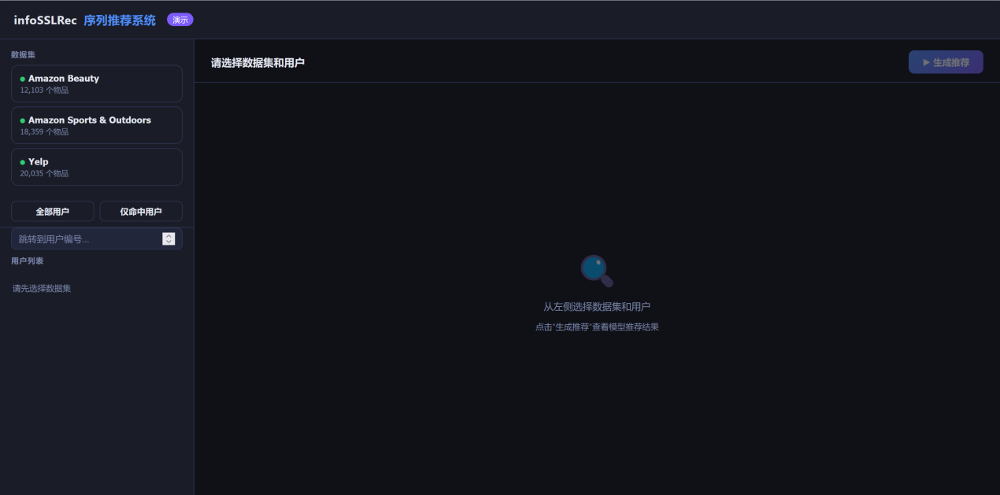 | 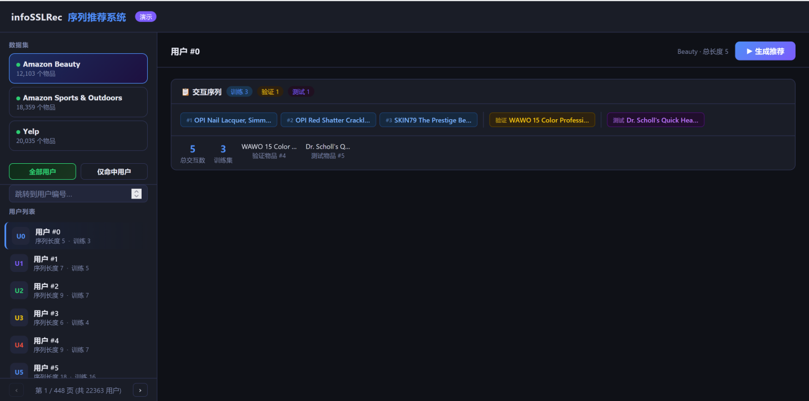 |
| **Step 3: Top-20 recommendation results** | **Step 4: Hit users (test item in Top-20)** |
| 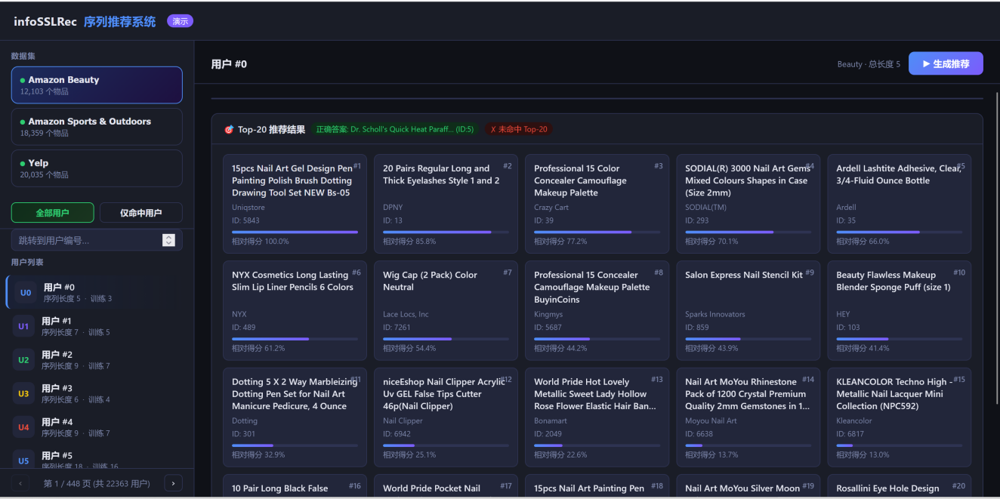 | 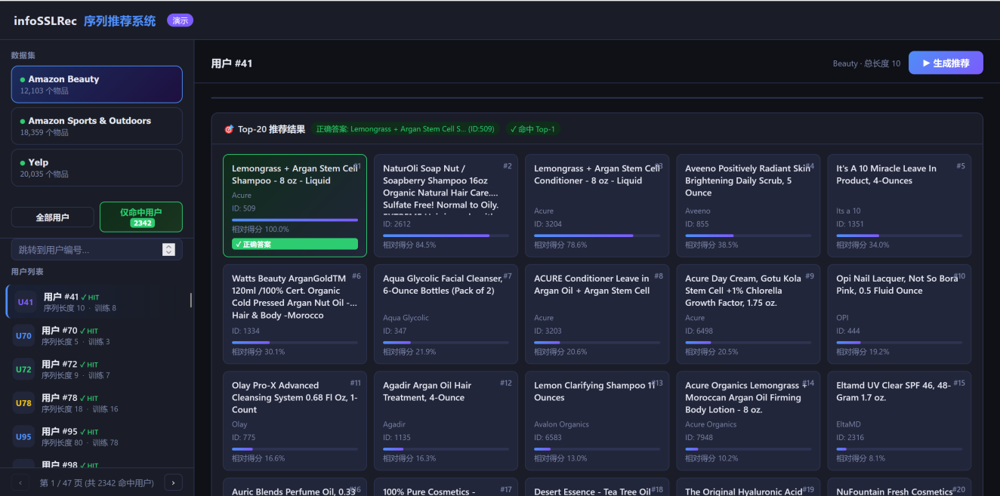 |

Each step is explained in detail, with full-size screenshots, in [How to use it](#how-to-use-it).

### Run the demo

```bash
# from the repository root, with the environment activated
python app.py
```

The console prints `CoSeRec 后端已启动：http://localhost:8000`. Open **<http://localhost:8000>** in Chrome, Edge, or Firefox. The server listens on `0.0.0.0:8000`, so other machines on the LAN can reach it at `http://<your-ip>:8000`. Press `Ctrl+C` to stop it.

**Requirements:**
- checkpoints `src/output/CoSeRec-Beauty-0.pt`, `CoSeRec-Sports_and_Outdoors-0.pt`, `CoSeRec-Yelp-0.pt`
- sequence files `data/Beauty.txt`, `data/Sports_and_Outdoors.txt`, `data/Yelp.txt`
- optional: item metadata `data/*_item_id_to_meta.json` (titles and brands) and the cached `data/*_hit_users.json`

To change the port, edit `PORT = 8000` at the bottom of `app.py`.

### How to use it

> The UI labels are in Chinese. The English names below are followed by the original labels.

The page has three areas. The **left sidebar** holds the dataset selector, user filter, and user list. The **top bar** holds the current user and the generate button. The **main panel** shows the sequence and the recommendations.

#### 1. Choose a dataset

The left sidebar lists the three datasets (Amazon Beauty, Amazon Sports & Outdoors, Yelp) with their item counts (`个物品`). The main panel prompts you to *select a dataset and a user* (`请选择数据集和用户`).

<p align="center"></p>
<p align="center"><em>Figure 5.1: Home page and dataset selection</em></p>

Click a dataset to load its sequences and model. The first load takes a few seconds.

#### 2. Browse users

The **User list** (`用户列表`) shows 50 users per page. Each entry shows the user index (`用户 #i`), the full sequence length (`序列长度`), and the training length (`训练`, the sequence length minus 2). You can:
- use **‹ / ›** at the bottom to change pages (`第 x / y 页 (共 N 用户)`)
- type a user index into **Jump to user** (`跳转到用户编号…`) and press **Enter**

#### 3. Inspect the interaction sequence

Click a user. The **Interaction sequence** (`交互序列`) card splits the history by the leave-one-out protocol:

| Tag | Meaning |
|---|---|
| `训练` Train (blue) | training items `#1 … #n-2`, in chronological order |
| `验证` Validation (yellow) | validation item (second to last) |
| `测试` Test (purple) | test item (last). This is the ground truth the model should predict |

Items show their real product or business names when metadata is available, and fall back to item IDs otherwise.

<p align="center"></p>
<p align="center"><em>Figure 5.2: Paginated user list and a user's interaction sequence</em></p>

#### 4. Generate recommendations

Click **▶ Generate Recommendations** (`▶ 生成推荐`) in the top-right corner. The backend:
1. takes every item except the test item (training + validation), keeps the latest 50, and left-pads with zeros
2. encodes the sequence with the Transformer and scores **all** items by dot product with the item embeddings
3. masks out items the user has already interacted with, then returns the **Top-20**

Each recommendation card shows its **rank**, **title**, **brand**, **item ID**, and a **relative score** (`相对得分`), which is the raw score Min-Max-normalized within the Top-20. The card header shows the ground-truth item (`正确答案`) and the outcome: either **✓ Hit Top-k** (`✓ 命中 Top-k`) or **✗ Missed Top-20** (`✗ 未命中 Top-20`).

<p align="center"></p>
<p align="center"><em>Figure 5.3: Top-20 recommendations for user #0 (test item not hit)</em></p>

A single request typically returns in tens of milliseconds on an ordinary PC.

#### 5. View hit users

Switch the filter from **All users** (`全部用户`) to **Hit users only** (`仅命中用户`). The backend runs batch inference over every user in the dataset and keeps the users whose test item appears in their Top-20. The badge on the button shows how many users hit (2,342 on Beauty in the screenshot), and the list marks each of them with **✓ HIT**. Open any of them and generate recommendations to see the correct item highlighted with a **✓ Correct** (`✓ 正确答案`) badge.

<p align="center"></p>
<p align="center"><em>Figure 5.4: Hit-user view. User #41's test item is ranked #1</em></p>

The first computation for a dataset can take a while on CPU. The result is cached in `data/<dataset>_hit_users.json`, so later requests return instantly. **Delete this cache file after you replace a checkpoint**, or the demo will keep showing the old hit list.

### REST API

All endpoints return JSON. You can call them directly, for example from scripts or another frontend.

| Method & Endpoint | Description |
|---|---|
| `GET /api/datasets` | Lists datasets: name, label, item count, `model_ready` flag |
| `GET /api/users/{dataset}?page=1&page_size=50` | Returns a paginated user list with `seq_len` and `train_len` |
| `GET /api/sequence/{dataset}/{user_idx}` | Returns `train_items`, `valid_item`, and `test_item`, each with title, brand, and categories |
| `GET /api/recommend/{dataset}/{user_idx}` | Returns the Top-20 with `rank`, `item_id`, `title`, `score`, `score_norm`, and `is_answer`, plus the ground-truth `answer` |
| `GET /api/hit_users/{dataset}` | Returns `total_users`, `hit_count`, `hit_rate`, and the hit user list (cached) |

`{dataset}` is one of `Beauty`, `Sports_and_Outdoors`, or `Yelp`. Example:

```bash
curl http://localhost:8000/api/recommend/Beauty/41
```

```json
{
  "user_idx": 41,
  "answer": 509,
  "answer_title": "Lemongrass + Argan Stem Cell Shampoo - 8 oz - Liquid",
  "recommendations": [
    {"rank": 1, "item_id": 509, "title": "Lemongrass + Argan Stem Cell Shampoo - 8 oz - Liquid",
     "brand": "Acure", "score": 9.87, "score_norm": 1.0, "is_answer": true},
    "..."
  ]
}
```

*(Scores are illustrative.)*

### Item metadata (optional)

Item titles come from `data/<dataset>_item_id_to_meta.json`. If a mapping file is missing, the demo falls back to item IDs only.

- **Yelp** (`yelp_item_id_to_meta.json`) and **Beauty** mappings are included.
- **Sports & Outdoors** has no mapping by default. To build it, or to rebuild the Beauty one, put the raw Amazon files in `amazon_data/` and run:

  ```bash
  python data/build_amazon_mapping.py
  ```

  The script uses the same ID assignment as S3-Rec preprocessing: filter reviews, sort by time, apply 5-core filtering, and assign IDs in order of first appearance. It expects:

  | Dataset | Review file | Metadata file |
  |---|---|---|
  | Beauty | `reviews_Beauty_5.json.gz` (falls back to `reviews_Beauty.json`) | `meta_Beauty.json` |
  | Sports | `reviews_Sports_and_Outdoors_5.json.gz` | `meta_Sports_and_Outdoors.json` |

  For **Sports & Outdoors**, use the **2014 5-core** file ([`reviews_Sports_and_Outdoors_5.json.gz`](http://snap.stanford.edu/data/amazon/productGraph/categoryFiles/reviews_Sports_and_Outdoors_5.json.gz), see [Download links](#download-links)). The newer full 2019 dump produces a different, incorrect ID mapping.

### Troubleshooting

| Symptom | Fix |
|---|---|
| `OSError: [Errno 98/10048] Address already in use` | Port 8000 is taken. Stop the other process or change `PORT` in `app.py`. |
| Selecting a dataset returns an error | Its checkpoint `src/output/CoSeRec-<dataset>-0.pt` or sequence file `data/<dataset>.txt` is missing. `GET /api/datasets` reports `model_ready` for each dataset. |
| Items show only numeric IDs | No `*_item_id_to_meta.json` exists for that dataset. See [Item metadata](#item-metadata-optional). |
| `size mismatch` when loading a checkpoint | `item_size` in `DATASETS` (`app.py`) must equal `max_item_id + 2` for that dataset's `.txt` file. |
| Hit list doesn't change after retraining | Delete `data/<dataset>_hit_users.json`. |

---

## Results

### Overall performance

| Dataset | Metric | BPR | Caser | S3-Rec | CL4SRec | **InfoSSLRec** |
|---|---|---:|---:|---:|---:|---:|
| **Beauty** | HR@5 | 0.0253 | 0.0270 | 0.0189 | 0.0403 | **0.0504** |
| | HR@10 | 0.0396 | 0.0453 | 0.0307 | 0.0641 | **0.0726** |
| | HR@20 | 0.0605 | 0.0724 | 0.0487 | 0.0972 | **0.1035** |
| | NDCG@5 | 0.0164 | 0.0167 | 0.0115 | 0.0265 | **0.0339** |
| | NDCG@10 | 0.0210 | 0.0225 | 0.0153 | 0.0343 | **0.0410** |
| | NDCG@20 | 0.0262 | 0.0294 | 0.0198 | 0.0425 | **0.0488** |
| **Sports** | HR@5 | 0.0131 | 0.0146 | 0.0121 | 0.0232 | **0.0259** |
| | HR@10 | 0.0208 | 0.0250 | 0.0205 | 0.0367 | **0.0417** |
| | HR@20 | 0.0314 | 0.0396 | 0.0344 | 0.0553 | **0.0603** |
| | NDCG@5 | 0.0086 | 0.0092 | 0.0084 | 0.0146 | **0.0173** |
| | NDCG@10 | 0.0111 | 0.0126 | 0.0111 | 0.0190 | **0.0224** |
| | NDCG@20 | 0.0137 | 0.0162 | 0.0146 | 0.0236 | **0.0270** |
| **Yelp** | HR@5 | 0.0163 | 0.0151 | 0.0101 | 0.0227 | **0.0231** |
| | HR@10 | 0.0270 | 0.0261 | 0.0176 | 0.0384 | **0.0396** |
| | HR@20 | 0.0433 | 0.0447 | 0.0314 | 0.0623 | **0.0649** |
| | NDCG@5 | 0.0101 | 0.0096 | 0.0068 | 0.0143 | **0.0146** |
| | NDCG@10 | 0.0136 | 0.0132 | 0.0092 | 0.0194 | **0.0199** |
| | NDCG@20 | 0.0177 | 0.0178 | 0.0127 | 0.0254 | **0.0263** |

InfoSSLRec is best on every metric for all three datasets. Against CL4SRec, the strongest baseline, which uses random augmentation only, it improves by an average of **22.47%** on Beauty, **23.39%** on Sports, and **4.67%** on Yelp across the six metrics. The gain is largest on Beauty and Sports, which have shorter sequences and a more severe cold-start problem.

### Ablation study

**Leave one operator out (NDCG@5).** Removing either informative operator (I or S) consistently lowers performance. On Beauty, removing Crop or Reorder even helps, which shows that random operators can break item correlations.

| Sports | Beauty |
| :---: | :---: |
| 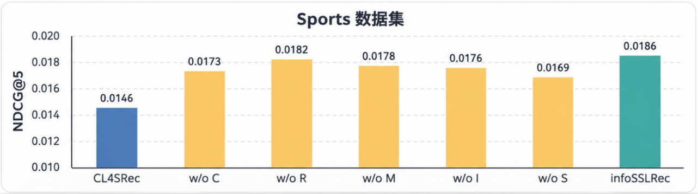 | 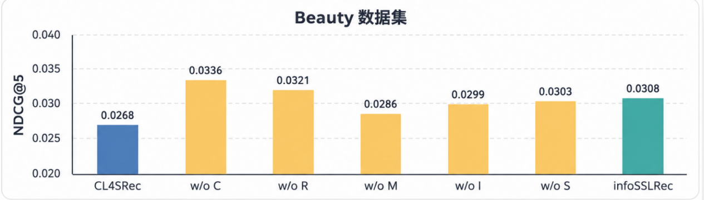 |

**Pairwise operators (NDCG@5 when the two views come from operators X and Y).** On the diagonal (same operator twice), Insert is best on Sports and Substitute is best on Beauty. Mixed pairs usually beat identical pairs. For example, on Beauty (I, S) scores 0.0309, against 0.0257 for (I, I) and 0.0264 for (S, S).

<p align="center">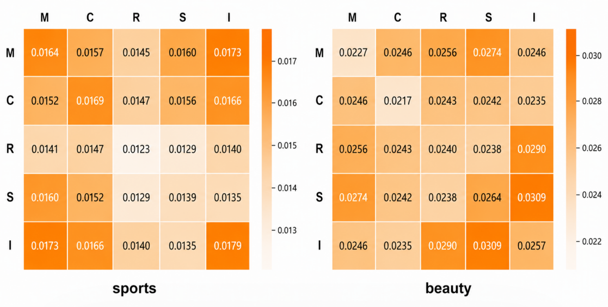</p>

**Operator sets for short sequences.** Every combination that contains S and I beats CL4SRec. `{S, I, M}` is best, and it also beats `{S, I, M, R, C}`, which shows that short sequences need their own operator set.

| Beauty | Sports |
| :---: | :---: |
| 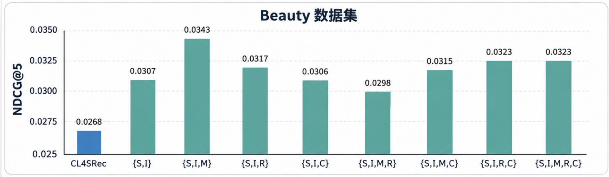 | 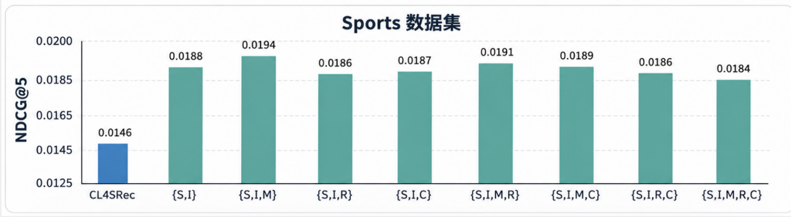 |

### Robustness to data sparsity

Models were trained on 25%, 50%, 75%, and 100% of the training data, with the test set fixed. InfoSSLRec beats CL4SRec at every ratio and degrades more slowly. On Sports, InfoSSLRec with 75% of the data roughly matches CL4SRec with 100%. At 50%, CL4SRec drops by **76.19%**, while InfoSSLRec drops by only **34%**. The bar labeled *CoSeRec* in these figures is InfoSSLRec.

| Sports | Beauty |
| :---: | :---: |
| 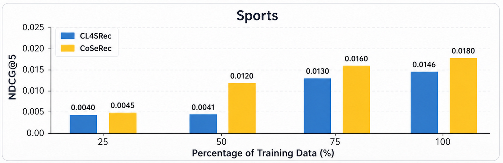 | 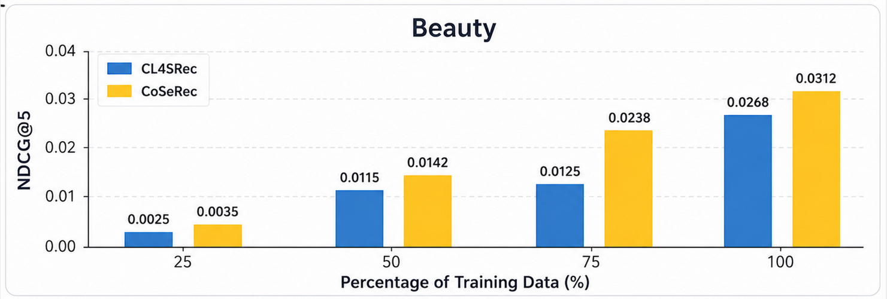 |

### Hyperparameter sensitivity

<p align="center">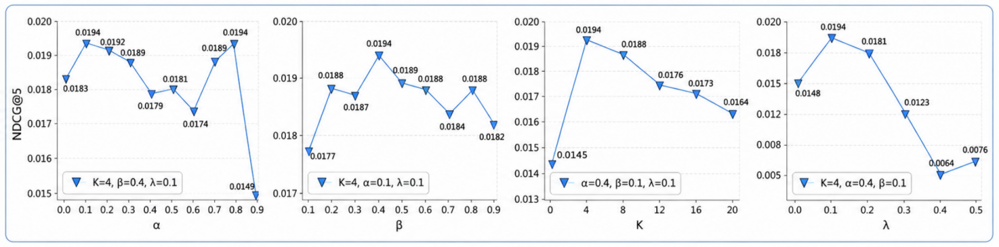</p>
<p align="center"><em>Sensitivity to α, β, K, and λ on Sports</em></p>

<p align="center">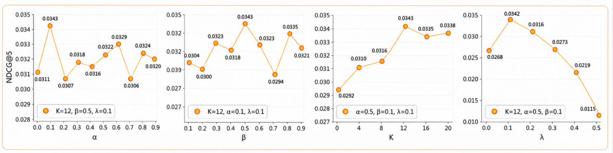</p>
<p align="center"><em>Sensitivity to α, β, K, and λ on Beauty</em></p>

- **α and β:** performance rises and then falls. Moderate ratios add useful correlation signal, while high ratios distort the original transitions and create false positive pairs. The best values are **β = 0.4** and **α = 0.1** on both datasets. The larger β suggests short sequences benefit from more insertion, and the smaller α shows that sequence semantics are sensitive to substitution.
- **K:** the best threshold follows each dataset's length distribution. **K = 4** works best on Sports (avg. length 8.3, mostly short sequences) and **K = 12** on Beauty (lengths more spread out).
- **λ:** compared with λ = 0 (no contrastive loss), adding contrastive learning improves NDCG@5 by **32.88%** on Sports and **12.82%** on Beauty. **λ = 0.1** works best, and larger values let the auxiliary task dominate.

---

## Acknowledgement

- The codebase is adapted from **CoSeRec**: Liu et al., *Contrastive Self-supervised Sequential Recommendation with Robust Augmentation*, [arXiv:2108.06479](https://arxiv.org/abs/2108.06479).
- The Transformer encoder and training pipeline come from [S3-Rec](https://github.com/RUCAIBox/CIKM2020-S3Rec).
- Baseline: CL4SRec (Xie et al., *Contrastive Learning for Sequential Recommendation*, ICDE 2022).
- Datasets: [Amazon Review Data](https://cseweb.ucsd.edu/~jmcauley/datasets/amazon/links.html) (McAuley et al., SIGIR 2015; He & McAuley, WWW 2016) and the [Yelp Open Dataset](https://www.yelp.com/dataset).

```bibtex
@article{liu2021contrastive,
  title   = {Contrastive self-supervised sequential recommendation with robust augmentation},
  author  = {Liu, Zhiwei and Chen, Yongjun and Li, Jia and Yu, Philip S and McAuley, Julian and Xiong, Caiming},
  journal = {arXiv preprint arXiv:2108.06479},
  year    = {2021}
}
```
